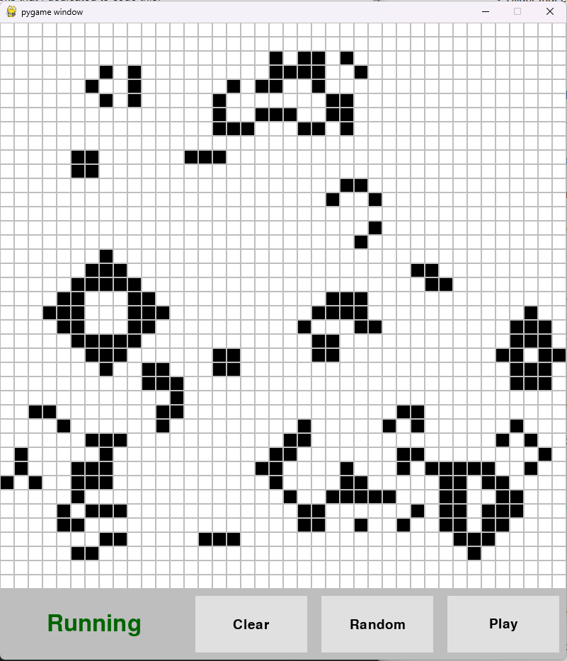

# Game of Life

[Conway's Game of Life](https://en.wikipedia.org/wiki/Conway%27s_Game_of_Life) implementation in Python using Pygame.

This project was started as a learning experience to get better with OOP and object inheritance in Python. It is noticeable that some parts of the code are cleaner than others, since I obviously learned a lot during the weeks that I dedicated to code this.

It was also the first time I used Pygame. Therefore, I am sure that there are good practices that I did not follow and better ways to implement what I did. Nevertheless, there are some conscious choices, such as coding the menu buttons from scratch, that I made because I truly wanted to implement them from scratch as a learning and practice experience.



You can also see a [video](demo/demo.mp4) of the current state of the game as of 31/05/2023.

## Features

Since this was a side project and I could not dedicate lots of time, I decided to limit the scope of what I wanted to implement.

- Regular grid of cells that the user can click on to change state (done)
- Working Game of Life that can propagate over time without Periodic Boundary Conditions (done)
- Some way for the user to start and stop the simulation (done)

### Optionals

- Periodic Boundary Conditions
- Some kind of UI menu for the user to click on (done)
- Clear and randomize states (done)
- Save and load states, including some predefined ones
- Camera that can move through the grid instead of having a fixed screen
- Slider that can change simulation speed

## How to use

I also decided to take the time to learn Poetry for environment management, which automatically creates a '.toml' file that can be used to install the dependencies.

Clone the repository at the desired location

```bash
git clone https://github.com/EloiSanchez/game-of-life
```

and go into the newly created directory

```bash
cd game-of-life
```

### Poetry

If using Poetry, create and activate the environment with

```bash
poetry install
poetry shell
```

and then run the game with

```bash
python game_of_life/game_of_life.py
```

or Windows/Mac or whatever equivalent.

### Others

If using any other environment manager, create a new environment and activate it. Then, run

```bash
pip install .
```

and then run the game with

```bash
python game_of_life/game_of_life.py
```

or Windows/Mac or whatever equivalent.

## About me

At the time of writing this I am an Analytics Engineer working mainly with Snowflake and dbt. Nevertheless, I still love to code more general stuff such as this game to keep on improving my general coding skills.

If you have any question, problem, suggestion or fix, please, create an issue or [contact me](mailto:eloisanchez16@gmail.com) directly.
